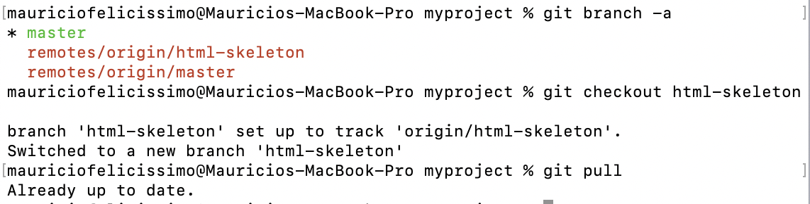

# hello-world
Hello World repository for Git tutorial
This is an example repository for the Git tutorial on https://www.w3schools.com
This tutorial focuses mainly on Git and using github as its remote.

This repository is built step by step in the tutorial.

It now includes steps for GitHub

This is a new line for the push branch section of the tutorial

# RELATORIO TÉCNICO DO TUTORIAL DE GITHUB

# Introdução
Neste trabalho vou apresentar um relatorio técnico que registre o meu trabalho que fiz ao realizar o tutorial de Git e GitHub. Este tutorial consiste de 7 etapas, sendo elas o GitHub Get Started, GitHub Edit Code, Pull from GitHub, Push to GitHub, GitHub Branch, Pull Branch from GitHub e Push Branch to GitHub. Ao longo do tutorial eu tirei prints de cada etapa que ia realizando conforme o tutorial pedia. Este tutorial me ensinou a utilizar linhas de comando no terminal Git para comunicar com o meu GitHub. Para começar este tutorial, foi preciso começar fazendo as etapas anteriores do tutorial, todas as do "Git Tutorial". Nessas etapas eu criei um repositorio local no Git onde adicionei 1 html, 1 css, 1 readme e 2 fotos. 

# Objetivo
O objetivo deste tutorial foi, como mencionei antes, a aprender a usar linhas de comando no terminal do Git para comunicar com o proprio GitHub. O tutorial me ensinou a juntar o repositorio local com o do GitHub, editar o codigo e os arquivos atraves do proprio GitHub e puxar estas alterações para o Git e vice versa também, criar e deletar novos branches no repositorio, fazer merge de 2 branches e resolver conflitos, etc.

# Resultados
Como esperado, por seguir cada etapa exatamente do jeito que o tutorial pedia, consegui realizar tudo e aprender tudo o que o tutorial tinha para me ensinar. Aqui irei explicar o passo a passo de cada etapa do tutorial.

Começei criando um repositorio novo no GitHub chamado de "hello-world"

Logo depois eu dei um push do repositorio local que eu criei na etapas anteriores do tutorial. Para isto eu utilizei a linha de comando 'git remote add origin' com o URL do repositorio que criei no GitHub. Este comando especifica que eu estou adicionando o repositorio remoto como origem do meu repositorio local do Git. Assim que fiz isso eu usei o comando 'git push --set-upstream origin master' para dar um push no branch mestre para o URL da origem.

Assim que eu fiz isso eu fui para o GitHub para ver as novas alterações no repositorio. Aqui consegui ver que todos os arquivos que eu havia criado no repositorio local do Git, estavam agora no repositorio 'hello-world' do GitHub. 

Na proxima etapa eu aprendí a fazer alterações no codigo atraves do proprio GitHub. Aqui eu adicionei uma linha no README.md e dei commit.

Depois disso chegou a hora de aprender a dar pull do GitHub no Git. Para isso eu aprendí a dar fetch e fazer merge. 
Eu começei usando o comando 'git fetch origin' para conseguir ver as mudanças que foram feitas no repositorio do GitHub.

Depois disso eu chequei o log dos repositorios local e o do GitHub.

Tambem chequei as diferenças entre os dois repositorios.

Verificando o log e as diferenças eu consegui ver que estava tudo como esperado, e agora podia fazer o merge.

Aí depois de aprender a fazer o fetch e o merge, eu aprendí a fazer pull sem ter que passar por todas estas etapas. 
Para fazer isso começei por adicionando uma linha nova no readme do GitHub, e dando commit.

Aí eu simplesmente usei o comando 'git pull origin' para atualizar o repositorio Git com a nova alteração.

A proxima etapa foi para aprender a dar push para o GitHub, e atualizar o 'hell-world' com alterações feitas no Git. 
Começei abrindo o index.html e fazendo uma alteração no código. 

Depois disso, usei o comando 'git commit -a -m "Updated index.html. Resized image"' para comitar a mudança feita, e logo depois fiz o push usando git push origin.

Para verificar que eu consegui realizar o push como esperado, voltei para o GitHub para ver se ele estava atualizado com as novas alterações que fiz no index.html

Depois, o tutorial me introduziu aos branches. Aprendí a criar novos branches e dar pull e push neles.
Primeiro aprendí a criar um branch novo atraves do GitHub. Chamei o branch de "html-skeleton".

Depois, fiz alterações no arquivo index.html, mas dentro desse branch novo. 

A proxima etapa me ensinou a fazer o pull desse branch novo, para atualizar o repositorio Git. 
Começei dando um pull geral, para atualizar o repositorio Git com a branch nova.

No pull consegui ver o Git identificou a adição do branch novo, mas quando usei o comando 'git branch' ele não mostrou o branch novo, então por isso tive que usar '-a' para ver todos os branches locais e remotos. Aí eu vi que o branch estava la, ent usei o comando de checkout para mudar de branch. Aí eu usei o comando de pull para verificar que o branch ja estava atualizado.

Na última etapa eu aprendi a criar um branch novo no repositorio Git e dar push desse branch para o GitHub.
Começei criando um branch novo e mudando para ele.

Dentro do branch novo, e fiz uma alteração no README e usei o comando status para verificar esta alteração. Quando vi que a alteração estava la, usei o add para adicionar o README no 'Staging Environment', para ficar pronto para dar o comit. 

Depois de fazer isso fui logo fazer o comit e o push dessa alteração

Aí eu entrei devolte no GitHub para confirmar que o push deu certo. 

Aqui eu conseguia ver as mudanças e podia fazer merge do branch novo com o branch principal. Para isso eu apertei no botão "Compare & Pull Request" para ver todas as alterações.

Ja que tudo estava em ordem, dei o pull, e aí fui fazer o merge das duas branches.

E finalmente, vi que deu certo, e agora podia deletar o branch novo, ja que o merge com o branch principal estava completo.

# Conclusão
Em conclusão, 
